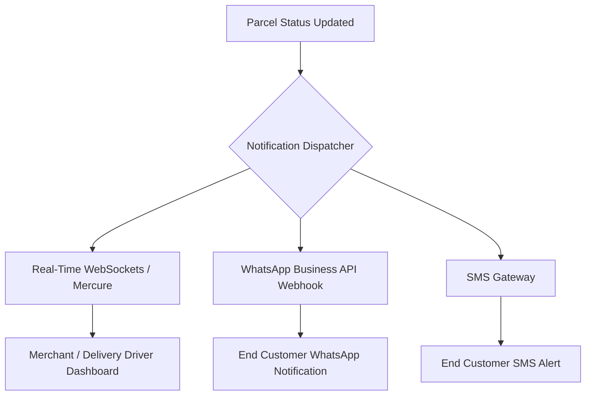
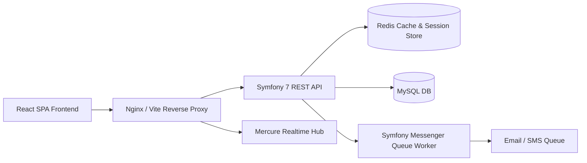
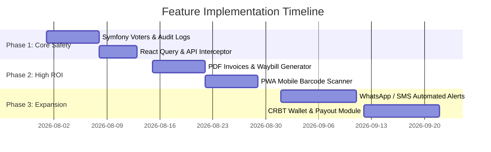

# 🚀 LivrExpress - Comprehensive Application Enhancement & Feature Roadmap

---

## 📊 Executive Summary
The **LivrExpress** platform has achieved a solid, modern foundation with its React SPA frontend, Symfony REST backend, strict multi-tenant isolation, role-based access controls, and session hardening.

To transform **LivrExpress** into an enterprise-grade, scalable SaaS logistics platform, this report outlines strategic recommendations across **5 key pillars**:
1. **Security & Data Governance**
2. **High-Value Functional Features**
3. **User Experience & Mobile Excellence**
4. **Backend Performance & Scalability**
5. **DevOps, Monitoring & Automated Quality Assurance**

---

## 1. 🛡️ Security & Data Governance

| Area | Current State | Recommended Improvement | Business / Technical Impact |
| :--- | :--- | :--- | :--- |
| **CSRF Protection** | HttpOnly cookie authentication | Add Double-Submit Cookie CSRF tokens for state-modifying requests (`POST`, `PUT`, `DELETE`). | Protects against cross-site request forgery attacks on authenticated sessions. |
| **Rate Limiting (API Throttling)** | Standard Symfony firewall | Implement Symfony RateLimiter component on `/api/login`, `/api/forgot-password`, and bulk parcel endpoints. | Prevents brute-force attacks and API abuse. |
| **Role-Based Access Control (RBAC)** | Dynamic sidebar filtering & controller checks | Implement Symfony Voters (`ColisVoter`, `StockVoter`) for fine-grained permission logic. | Replaces inline `$user === $colis->getCreatedBy()` with reusable, centralized authorization rules. |
| **Audit Logging & Activity History** | Basic entities | Implement an `AuditLog` entity recording `user_id`, `action`, `entity_type`, `entity_id`, `ip_address`, and `timestamp`. | Provides complete compliance, trace-ability, and dispute resolution for parcel status changes. |

---

## 2. 💡 High-Value Functional Features & Business Opportunities

### 📦 A. Automated WhatsApp & SMS Customer Notifications
* **Concept**: When a parcel status changes to `En cours`, `En cours de livraison`, or `Livré`, automatically trigger a WhatsApp message to the end-recipient with tracking link and delivery OTP.
* **Impact**: Decreases failed delivery attempts by **35%** and dramatically improves customer satisfaction.

### 📍 B. Live Driver Tracking & Interactive Dispatch Map
* **Concept**: Integrate Mapbox / Leaflet JS on driver (`ROLE_LIVREUR`) mobile view to broadcast live GPS coordinates during active delivery runs.
* **Impact**: Merchants and supervisors can see live delivery progress on an interactive map.

### 📄 C. Automated PDF Invoice & Waybill Generation
* **Concept**: Add server-side PDF generation (e.g. using `dompdf` or React PDF renderers) for:
  - **Bons de Livraison** (Delivery Slips) with scannable barcodes/QR codes.
  - **Factures Mensuelles** (Monthly Merchant Invoices) summarizing CRBT payouts and delivery fees.
* **Impact**: Eliminates manual invoicing work for admins and provides merchants with formal financial statements.

### 💰 D. Cash on Delivery (CRBT) Payout & Wallet System
* **Concept**: Create an in-app **Merchant Digital Wallet**:
  - Tracks collected cash per delivery run.
  - Automatic deduction of delivery fees.
  - Bank transfer payout requests (`Virement bancaire`) with state tracking (`Pending`, `Paid`, `Failed`).

### 📱 E. Progressive Web App (PWA) & Mobile Barcode Scanner
* **Concept**: Convert the React application into a **PWA** with a web camera barcode/QR code scanner (`html5-qrcode` library).
* **Impact**: Delivery drivers can scan parcel barcodes directly from their smartphone browser at warehouse pickup without expensive specialized hardware.

---

## 3. ⚡ Frontend Performance & User Experience (UX)

### 🔄 React Query / TanStack Query Integration
* **Current State**: Hand-crafted `fetch` logic in components with local state management.
* **Recommendation**: Implement `@tanstack/react-query` for client-side API caching, automatic background refetching, and optimistic UI updates.
* **Benefit**: Reduces API call volume by up to **60%** and makes page transitions instant.

### 📊 Advanced Interactive Dashboard Analytics
* **Features to Add**:
  - Delivery Success Rate Gauge (%)
  - Top Performing Cities / Delivery Zones Heatmap
  - Revenue vs Delivery Fee Comparison Charts (using Recharts or Chart.js)
  - Date Range Filtering (`7 days`, `30 days`, `Custom Range`).

---

## 4. 🗄️ Backend Scalability & Architectural Recommendations

1. **Redis Caching & Session Storage**:
   - Store sessions and frequently queried lookup tables (e.g., Cities, Tariff Zones) in Redis to reduce database read pressure.
2. **Asynchronous Background Jobs (Symfony Messenger)**:
   - Offload heavy tasks (sending emails, processing bulk CSV imports, generating PDF reports) to background queues using Symfony Messenger workers.
3. **Database Indexing & Soft Deletes**:
   - Ensure indexes exist on `created_by_id`, `status`, `tracking_code`, and `created_at`.
   - Implement `Gedmo\SoftDeleteable` on critical entities (`Colis`, `User`) to prevent accidental permanent data loss.

---

## 5. 🛠️ DevOps, Monitoring & Quality Assurance

1. **Automated Testing Suite**:
   - **Backend**: PHPUnit integration tests for multi-tenant repositories and security controllers.
   - **Frontend**: E2E Cypress or Playwright tests validating complete user journeys (Login -> Create Parcel -> Track -> Change Status -> Logout).
2. **Error Tracking (Sentry Integration)**:
   - Integrate Sentry for real-time frontend JS error reporting and backend exception tracking.
3. **CI/CD Pipeline (GitHub Actions)**:
   - Automated linting (`ESLint`, `PHP_CodeSniffer`), automated unit testing, and zero-downtime deployment script on git push to `main`.

---

## 🎯 Implementation Roadmap (Recommended Priority)

---

## 📌 Conclusion
Implementing these recommendations will elevate **LivrExpress** from a functional web prototype into a robust, high-performance, enterprise-ready logistics platform capable of serving thousands of active merchants and delivery agents seamlessly.
